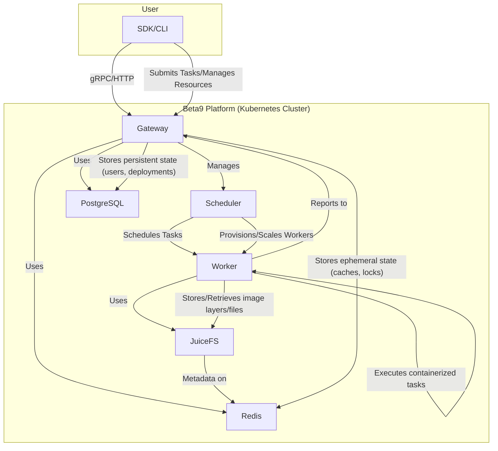

# Beta9 Documentation

This document provides a high-level overview of the Beta9 platform, its components, architecture, and dependencies.

## 1. Overview

Beta9 is a distributed task execution platform designed to run containerized workloads. It consists of a central control plane (the Gateway) and a distributed data plane of Workers. It's designed to be a flexible and scalable platform for running various types of container-based tasks, from serverless functions to long-running services.

The platform is built with a microservices architecture, with gRPC used for internal communication between components. It is designed to be deployed on Kubernetes.

## 2. Architecture Diagram

## 3. Components

### 3.1. Gateway

The Gateway is the central control plane of the Beta9 platform. It is a stateless service that acts as the brain of the system.

**Responsibilities:**

*   **API Server:** Exposes a gRPC and a RESTful HTTP API for clients (like the Python SDK) to interact with the platform. This includes operations for managing applications, deployments, tasks, secrets, and more.
*   **Authentication & Authorization:** Handles authentication of all incoming requests.
*   **Service Orchestration:** Manages and integrates with all other backend services. It initializes and registers a large number of services that handle different parts of the application's logic, such as:
    *   `ImageService`: Manages container images.
    *   `FunctionService`: Manages serverless functions.
    *   `TaskQueueService`: Manages task queues.
    *   `VolumeService`: Manages storage volumes.
    *   `PodService`: Manages pods (groups of containers).
    *   And many others.
*   **Scheduler:** Includes a sophisticated scheduler that is responsible for:
    *   Provisioning and scaling workers based on demand.
    *   Assigning tasks to available workers based on resource requirements (CPU, memory, GPU).
    *   Managing worker pools, which can be in-cluster (Kubernetes jobs) or external (on dedicated machines).

### 3.2. Worker

The Worker is the data plane component of the platform. Workers are responsible for actually executing the containerized tasks.

**Responsibilities:**

*   **Task Execution:** Receives task execution requests from the Gateway's scheduler.
*   **Container Runtime:** Uses `runc`, a low-level container runtime, to run OCI-compliant containers. This provides fine-grained control over the container lifecycle.
*   **Image Management:** Pulls container images required for task execution. It can use a blob cache (`blobcache`) for faster image pulls.
*   **State Reporting:** Reports its status, resource capacity, and health back to the Gateway via gRPC.
*   **Checkpoint/Restore (CRIU):** The codebase includes support for CRIU, which allows for checkpointing and restoring running containers. This can be used for features like fast container startup or live migration.

### 3.3. Runner

The Runner is not a separate service, but rather the execution environment itself. It's a base Docker image that contains a specific set of pre-installed dependencies, most importantly a specific version of Python. When a user defines a task, they specify an `Image` which corresponds to a specific Runner image.

**How Workers and Runners Interact:**

1.  The **Worker** receives a task request from the Gateway, which specifies a required environment (e.g., Python 3.11).
2.  The Worker pulls the pre-built **Runner** image that is tagged for that environment.
3.  The Worker then takes the user's code, injects it into a new container based on that **Runner** image, and uses `runc` to execute it.

This separation of the **Worker** (the manager) and the **Runner** (the environment) is what allows Beta9 to start containers very quickly.

## 4. Dependencies

The Beta9 platform relies on several external services for its operation:

*   **PostgreSQL:** This is the primary database for storing persistent state. This includes information about:
    *   Users and workspaces
    *   Applications and deployments
    *   Other long-lived configuration data.
*   **Redis:** Used for storing ephemeral data, caching, and as a message bus. It is used for:
    *   Worker state and keep-alives.
    *   Caching various data to improve performance.
    *   Distributed locks.
    *   As a metadata store for JuiceFS.
*   **JuiceFS:** A distributed POSIX file system. In Beta9, it is likely used for:
    *   Storing container image layers to be shared among workers.
    *   Shared volumes for containers.

## 5. External Requirements

To deploy and run Beta9, you need:

*   **A Kubernetes Cluster:** The platform is designed to be deployed on Kubernetes. The Helm chart in `deploy/charts/beta9` orchestrates the deployment of the gateway and its dependencies.
*   **Container Registry:** A registry (like AWS ECR) is needed to store the Docker images for the Gateway, Worker, and other components.
*   **Object Storage (Optional):** If `Fluent Bit` is enabled for log shipping, an S3-compatible object store is required to store worker logs.

### Worker Deployments: Static vs. Dynamic

The Beta9 Helm chart includes an optional worker deployment. Here's the difference between enabling and disabling it:

*   **Dynamic Workers (worker.enabled: false):** This is the default, "serverless" mode. The Gateway's scheduler will dynamically launch workers as Kubernetes Jobs when tasks arrive. This is highly resource-efficient and allows the cluster to scale down to zero, but it can introduce a "cold start" latency as new pods are created.
*   **Static Worker Pool (worker.enabled: true):** This creates a pre-warmed, static pool of workers. The Helm chart will create a Kubernetes Deployment with a fixed number of worker pods that are always running and waiting for tasks. This provides lower latency for task execution, as the Gateway can immediately assign tasks to idle workers.

## 6. Usage Flow

A typical usage flow of the Beta9 platform looks like this:

1.  **Deployment:** A user defines an application or a task, which includes a container image and resource requirements.
2.  **Submission:** Using the SDK or CLI, the user submits the application to the **Gateway**.
3.  **Scheduling:** The **Gateway's Scheduler** receives the request. It finds or provisions a suitable **Worker** in a worker pool that can meet the resource requirements.
4.  **Task Assignment:** The Scheduler sends a container creation request to the chosen **Worker**.
5.  **Execution:** The **Worker** pulls the container image (potentially using **JuiceFS** or a blob cache for speed) and uses `runc` to start the container.
6.  **Monitoring:** The **Worker** monitors the container and streams logs and status updates back to the **Gateway**. The user can query the Gateway to see the status of their task.
7.  **Completion:** Once the task is finished, the **Worker** reports the completion to the **Gateway** and becomes available for new tasks.

## 7. Authentication

Authentication is handled by the Gateway. The primary authentication mechanism is token-based.

*   **Client Authentication:** Clients (like the SDK) must include a valid authentication token in their requests to the Gateway. This token is typically an API key associated with a user or a service account.
*   **Worker Authentication:** Workers also need to authenticate with the Gateway. This is handled automatically by the platform:
    1.  When the Gateway's scheduler provisions a new worker, it generates a unique, single-use token for that worker.
    2.  The scheduler securely stores a hash of this token in the PostgreSQL database.
    3.  The raw token is passed to the worker via the `WORKER_TOKEN` environment variable.
    4.  The worker includes this token in the metadata of every gRPC call it makes to the Gateway.
    5.  The Gateway's gRPC server uses an interceptor to validate the token. It hashes the incoming token and compares it against the stored hashes in the database.

If a request is made to the Gateway without a valid token, it will be rejected with an "Unauthenticated" error. This is a security measure to ensure that only authorized clients can interact with the platform. 